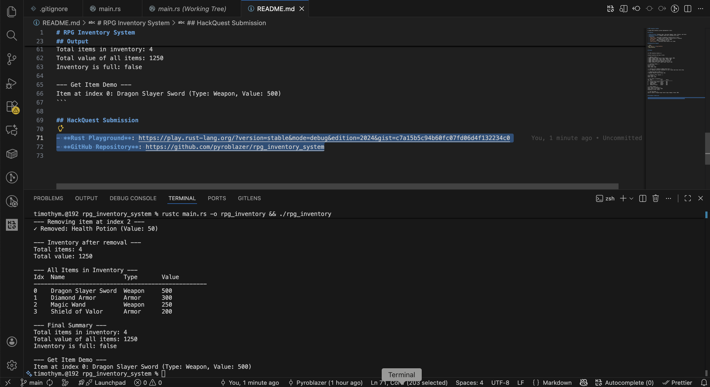
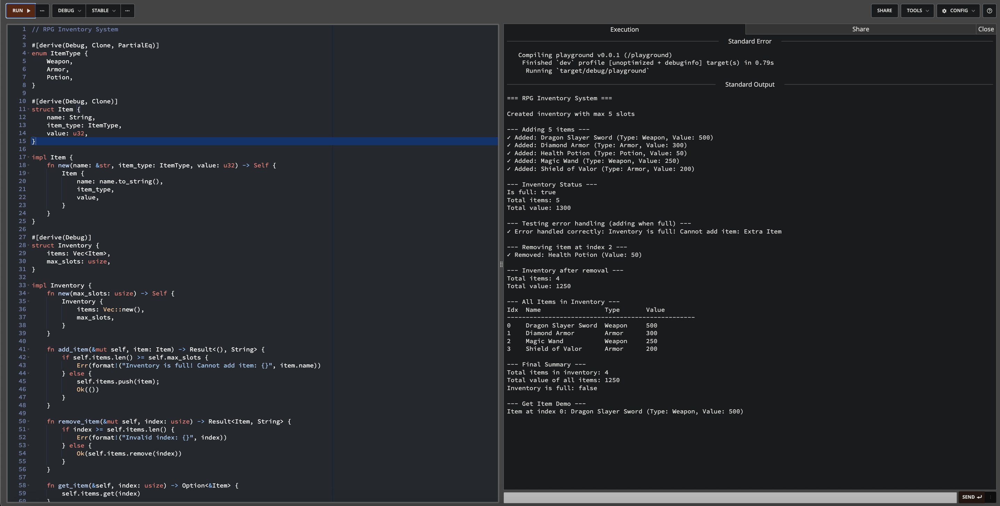

# RPG Inventory System

A simple RPG inventory system implemented in Rust.

## Features

- **Item Struct**: Contains name, item_type (Weapon, Armor, Potion), and value
- **Inventory Struct**: Manages items with a maximum slot limit
- **Methods**:
  - `add_item()` - Add item to inventory (returns error if full)
  - `remove_item()` - Remove item by index (returns error if invalid)
  - `get_item()` - Get reference to item at index
  - `is_full()` - Check if inventory is full
  - `total_value()` - Calculate total value of all items

## Running the Program

```bash
rustc main.rs -o rpg_inventory
./rpg_inventory
```

## Output

```
=== RPG Inventory System ===

Created inventory with max 5 slots

--- Adding 5 items ---
✓ Added: Dragon Slayer Sword (Type: Weapon, Value: 500)
✓ Added: Diamond Armor (Type: Armor, Value: 300)
✓ Added: Health Potion (Type: Potion, Value: 50)
✓ Added: Magic Wand (Type: Weapon, Value: 250)
✓ Added: Shield of Valor (Type: Armor, Value: 200)

--- Inventory Status ---
Is full: true
Total items: 5
Total value: 1300

--- Testing error handling (adding when full) ---
✓ Error handled correctly: Inventory is full! Cannot add item: Extra Item

--- Removing item at index 2 ---
✓ Removed: Health Potion (Value: 50)

--- Inventory after removal ---
Total items: 4
Total value: 1250

--- All Items in Inventory ---
Idx  Name                 Type       Value     
--------------------------------------------------
0    Dragon Slayer Sword  Weapon     500       
1    Diamond Armor        Armor      300       
2    Magic Wand           Weapon     250       
3    Shield of Valor      Armor      200       

--- Final Summary ---
Total items in inventory: 4
Total value of all items: 1250
Inventory is full: false

--- Get Item Demo ---
Item at index 0: Dragon Slayer Sword (Type: Weapon, Value: 500)
```

## Screenshots

### Mac Terminal output


### Rust Playground output


## HackQuest Submission

- **Rust Playground**: https://play.rust-lang.org/?version=stable&mode=debug&edition=2024&gist=c7a15b5c94b60fc07fd06d4f132234c0
- **GitHub Repository**: https://github.com/pyroblazer/rpg_inventory_system
